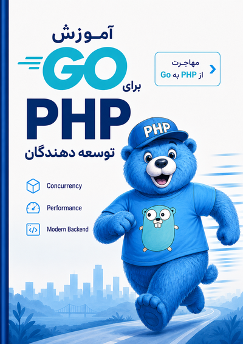

<div dir="rtl" align="center">

# از PHP تا Go



### راهنمای جامع مهاجرت از PHP به Go برای توسعه‌دهندگان وب

[](./00.00-front-matter.html)
[](./00.01-contents.html)

---

</div>

<div dir="rtl">

این کتاب یک منبع جامع و آزاد برای مهاجرت از PHP به Go است. محتوای این کتاب از منابع معتبر جمع‌آوری و تنظیم شده و به شما گام‌به‌گام می‌آموزد که چگونه با استفاده از زبان برنامه‌نویسی [Go](https://golang.org/)، برنامه‌های وب سریع، امن و قابل نگهداری ایجاد کنید — با تمرکز ویژه بر توسعه‌دهندگان PHP.

## ✨ ویژگی‌ها

- 🔄 **رویکرد مقایسه‌ای** — هر مفهوم Go در کنار معادل PHP بررسی می‌شود تا تفاوت‌ها و شباهت‌ها بهتر درک شود
- 📖 **۱۲ فصل و بیش از ۵۰ مبحث** — از فلسفه زبان تا بهینه‌سازی عملکرد در پروداکشن
- 💻 **نمونه‌کد عملی** — کدهای واقعی با مقایسه side-by-side بین PHP و Go
- 🧠 **نکات حرفه‌ای مهندسی** — بینش‌های معماری، خطاهای رایج production و الگوهای طراحی
- 📝 **نقل‌قول‌های تخصصی** — از کتاب‌های Clean Code، Pragmatic Programmer و Refactoring
- 📊 **دیاگرام‌های تعاملی** — نمودارهای SVG با قابلیت زوم برای درک بهتر مفاهیم
- 🌙 **پشتیبانی از حالت تاریک** — مطالعه راحت در هر شرایط نوری
- 📱 **طراحی واکنش‌گرا** — مطالعه در موبایل، تبلت و دسکتاپ
- 🔍 **جستجوی سریع** — یافتن سریع مطالب با Ctrl+K
- 📊 **پیشرفت خواندن** — ردیابی خودکار پیشرفت مطالعه

## 📚 فصول کتاب

| فصل | عنوان | مباحث کلیدی |
|-----|-------|-------------|
| ۱ | فلسفه و مبانی | تقابل فلسفی PHP و Go، Idiomatic Go، ابزارها، ساختار پروژه |
| ۲ | انواع داده و ساختارهای کنترلی | Type Conversion، توابع و متدها، اشاره‌گرها، جنریک‌ها |
| ۳ | پکیج‌ها، ماژول‌ها و شی‌گرایی | مدیریت dependency، چرخه حیات برنامه، Interface، Constructor و Factory |
| ۴ | مدیریت خطا | error در Go، خطاهای سفارشی، panic و recover |
| ۵ | همزمانی | Goroutine، Channel، Select، Context، Race Condition، Concurrency Patterns، Goroutine Leak |
| ۶ | تعامل با دنیای بیرون | فایل‌ها، JSON/YAML، جاسازی فایل با embed، سیگنال‌های سیستم‌عامل |
| ۷ | ساخت وب‌سرور | Routing، Middleware، Cookie/Session، قالب‌های HTML، پردازش فرم |
| ۸ | پایگاه داده | Migration، database/sql، تراکنش‌ها، مدیریت خطا، Redis |
| ۹ | مانیتورینگ و Observability | Logging، Prometheus و Grafana، OpenTelemetry |
| ۱۰ | دیباگ و ریشه‌یابی | دیباگ خطاها، Delve، یکپارچگی با VSCode |
| ۱۱ | تست‌نویسی | مقدمات تست، Assertion، gomock، httpexpect، تست End-to-End |
| ۱۲ | بهینه‌سازی عملکرد | اصول بهینه‌سازی، نکات کاربردی، GC و مدیریت حافظه |

## 🗺️ برای چه کسانی است؟

- **توسعه‌دهندگان PHP** که می‌خواهند Go را یاد بگیرند و از تجربه PHP خود بهره ببرند
- **مهندسانی** که در حال مهاجرت پروژه‌های PHP به Go هستند و به نقشه راه نیاز دارند
- **تیم‌هایی** که از Laravel/Symfony به اکوسیستم Go منتقل می‌شوند
- **همه کسانی** که علاقه‌مند به مقایسه فلسفی و فنی دو زبان محبوب وب هستند

## 🚀 اجرا و مطالعه

### اجرای محلی با Make

ساده‌ترین راه برای مطالعه کتاب، اجرای آن روی یک وب‌سرور محلی است. پروژه شامل یک `Makefile` است که با یک دستور کتاب را برای شما اجرا می‌کند:

```bash
make
```

این دستور یک وب‌سرور محلی روی پورت ۳۰۰۰ راه‌اندازی کرده و مرورگر را با صفحه کتاب باز می‌کند. نیازی به نصب هیچ وابستگی‌ای نیست — `npx` به صورت خودکار `http-server` را دانلود و اجرا می‌کند.

سایر دستورات:

| دستور | توضیح |
|-------|-------|
| `make` | سرور را بالا می‌آورد و مرورگر را باز می‌کند |
| `make serve` | فقط سرور را بالا می‌آورد (بدون باز کردن مرورگر) |
| `make open` | اگر سرور در حال اجراست، مرورگر را باز می‌کند |
| `make help` | راهنمای دستورات را نشان می‌دهد |
| `make PORT=8080` | اجرا روی پورت دلخواه (پیش‌فرض: ۳۰۰۰) |

### مطالعه آنلاین

همچنین می‌توانید مستقیماً به [پیش‌گفتار](./00.00-front-matter.html) مراجعه کنید یا از [فهرست مطالب](./00.01-contents.html) فصل مورد نظر خود را انتخاب کنید.

## 📥 دانلود نسخه‌های کتاب

نسخه‌های قابل حمل کتاب برای مطالعه در دستگاه‌های کتاب‌خوان، تبلت و گوشی در دسترس است:

| فرمت | توضیح | دانلود |
|------|-------|--------|
| **EPUB** | سازگار با اکثر کتاب‌خوان‌ها (Apple Books، Google Play Books، Calibre و ...) | [php-to-go-fa.epub](./files/php-to-go-fa.epub) |
| **MOBI** | سازگار با Amazon Kindle | [php-to-go-fa.mobi](./files/php-to-go-fa.mobi) |

> این نسخه‌ها به‌روزرسانی نمی‌شوند. برای آخرین تغییرات و محتوای به‌روز، نسخه آنلاین یا اجرای محلی را مطالعه کنید.

## 🤝 مشارکت

این پروژه آزاد است و از مشارکت استقبال می‌شود. اگر نکته‌ای برای بهبود محتوا، اصلاح خطا یا اضافه کردن مبحث جدید دارید، Pull Request بفرستید یا Issue ثبت کنید.

## 🛠️ ساخت با

- HTML5 و CSS3
- [Vazirmatn](https://github.com/rastikerdar/vazirmatn) — فونت فارسی
- [Fira Code](https://github.com/tonsky/FiraCode) — فونت کد
- [Highlight.js](https://highlightjs.org/) — برجسته‌سازی سینتکس
- طراحی واکنش‌گرا و پشتیبانی از حالت تاریک

</div>
